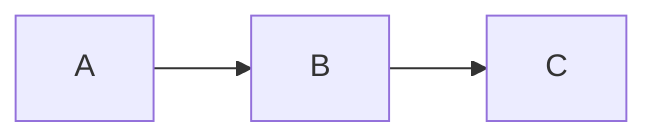

# Obsidian Wiki Redesign

> **Date:** 2026-01-13
> **Status:** Validated

## Goal

A living spec wiki that lives alongside code, capturing behavior specifications and ADRs. Agents can be pointed at a workstream or spec to revise code. The spec is the source of truth - code follows.

## Key Decisions

### Location: `docs/`
- **Problem:** `.plans/` is hidden, agents can't find it and create orphan sub-wikis
- **Solution:** Use `docs/` as primary location
- **Discovery order:** `docs/` → `docs/wiki/` → `wiki/` → `.plans/*/`

### Structure: Workstreams + Specs (not Phases + Tasks)
- **Problem:** Phases are temporal (when we built it), not functional (what it does)
- **Solution:** Workstreams = logical functional areas, Specs = behavior documents
- **Rationale:** Specs remain valuable even if code is deleted - you can rebuild from them

### Spec Format: Behavior + Context + Integration
- **Behavior:** Contract (inputs/outputs/pre/post) + Scenarios (edge cases)
- **Context:** Full ADR format (status, context, decision, consequences, alternatives)
- **Integration:** Wiki-linked dependencies/consumers + Mermaid diagram

### Wiki Links Everywhere
- **Problem:** Specs reference each other but go stale
- **Solution:** All references are `[[wiki-links]]` - broken links signal sync issues

## Directory Structure

```
docs/
├── README.md              # Index with workstream table
├── CLAUDE.md              # Global agent rules
├── changelog.md           # Keep a Changelog format
├── workstreams/
│   └── NN-name/
│       ├── README.md      # Executive summary + spec table
│       ├── CLAUDE.md      # Optional workstream-specific rules
│       └── N.N-spec.md    # Behavior specs
├── reference/             # Shared architecture docs
└── research/              # Oracle outputs (frozen)
```

## Templates

### Spec File Template

```markdown
# N.N Spec Name

> **Workstream:** [[../README|NN-Workstream-Name]]

## Behavior

### Contract
- **Input:** description
- **Output:** description
- **Preconditions:** what must be true before
- **Postconditions:** what will be true after

### Scenarios
- When X happens → Y should occur
- When edge case → handle gracefully

## Decisions

### ADR-1: Decision Title
- **Status:** Proposed | Accepted | Deprecated | Superseded
- **Context:** Why this decision was needed
- **Decision:** What we decided
- **Consequences:** What happens as a result
- **Alternatives:** What we considered and rejected

## Integration

### Dependencies
- [[path/to/spec|Display Name]] - what we need from it

### Consumers
- [[path/to/spec|Display Name]] - what uses us

### Diagram

```

### Workstream README Template

```markdown
# NN Workstream Name

> Brief description of what this workstream covers.

## Goal
What this workstream achieves.

## Specs

| Spec | Description | Status |
|------|-------------|--------|
| [[N.1-spec-name]] | Brief description | Status |
| [[N.2-spec-name]] | Brief description | Status |

## Shared Decisions

ADRs that apply to all specs in this workstream:
- **Decision:** Brief summary

## Integration Points

This workstream connects to:
- [[../other-workstream/README|Other Workstream]] - how
```

### Root README Template

```markdown
# Project Wiki

> **For Claude:** Start here. Read workstream READMEs for context, then specific specs as needed.

## Workstreams

| # | Workstream | Description |
|---|------------|-------------|
| 01 | [[workstreams/01-name/README\|Name]] | Description |

## Quick Links

- [[CLAUDE]] - Rules for agents
- [[changelog]] - What changed and when
- [[reference/architecture]] - System overview

## Research

Oracle/Delphi outputs (frozen snapshots):
- [[research/topic]] - Description
```

## Delphi Findings

Three oracles investigated the existing wiki at `/Users/alexander/Projects/browser/.plans/refresh-browser/`:

1. **Fragmentation is real:** Sub-wikis in `research/devtools/` and `research/context-menu-bridge/` both plan to create the same file (`devtools_bridge.h`) - coordination failure, not sophistication
2. **Hidden location is root cause:** Agents couldn't find `.plans/`, created their own wikis
3. **Migrate to `docs/`:** All 3 oracles agreed

See: `.oracle/wiki-redesign-skeptical/` for full reports.
